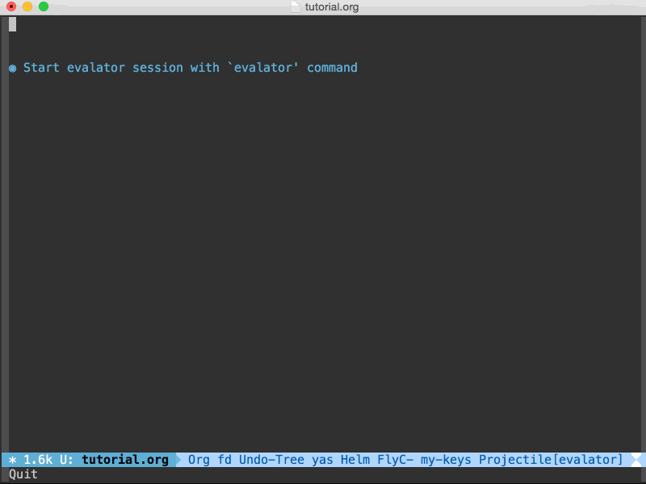

[](https://melpa.org/#/evalator)
[](http://stable.melpa.org/#/evalator)


# EVALATOR #

## Introduction ##

Evalator is an Emacs package built on top of [helm](https://github.com/emacs-helm/helm) that allows for interactive evaluation and transformation of data.  You can use evalator for several things but here's a few:

*   Test a calculation
*   Generate code
*   Build and execute a complex shell command

Evalator uses Elisp by default, but supports other languages through evaluation context packages.  One nice thing about this is you can generate some data using your favorite language and use that as the input to an Emacs command.

Available context packages:

*   [Clojure(via CIDER)](https://github.com/seanirby/evalator-context-cider)(coming soon)

Don't see a context package for your favorite language?  Write one!  See [evalator-context-elisp.el](https://github.com/seanirby/evalator/blob/master/evalator-context-elisp.el) and [evalator-context-cider.el](https://github.com/seanirby/evalator-context-cider/blob/master/evalator-context-cider.el) for examples.  Open an issue in this repo with any questions and I'll be happy to help.

Here's a practical example to demonstrate what evalator's capable of:

### A Practical Example ###
Suppose you have several Emacs packages and want to generate an elisp configuration file for each one in your current directory.  Each file should be named ```setup-$PACKAGE.el``` with ```$PACKAGE``` equaling the package name.  Each file should contain the following line.

```
(provide 'setup-$PACKAGE)
```

Watch the example below to see how easy this is with evalator.


Here's what happened:

* Copy all package names
* Call ```M-x evalator``` to start an evalator session
* Paste the package names into a lisp list ```'()```
* Build a string for the shell command I want executed for each package
* Call the Emacs command ```shell-command``` with each of the strings from before
* Exit evalator using <kbd>C-g</kbd>
* Verify the files are created with the right contents

See the [Basic Usage](#basic-usage) section for a detailed walkthrough.

## Installation ##

Evalator is available through the [MELPA](http://melpa.org/) repository.  You can install it by using Emacs's built-in package manager ```package.el```.

If you haven't configured ```package.el```, see [here](https://github.com/milkypostman/melpa#usage) for a short guide on setting it up to use MELPA.

Once configured, you can run ```M-x package-install``` then enter ```evalator``` to install evalator.

## Setup ##

Add the following to your init file
```
;;Suggested keybindings
(global-set-key (kbd "C-c e e") 'evalator)
(global-set-key (kbd "C-c e x") 'evalator-explicit)
(global-set-key (kbd "C-c e r") 'evalator-resume)
(global-set-key (kbd "C-c e i") 'evalator-insert-equiv-expr)
```

## <a name="basic-usage"></a> Basic Usage ##



### Public API ###

Command                                                                                    | Description
-------------------------------------------------------------------------------------------|---------------------------
<span style="white-space: nowrap;">```evalator```</span>                                   | Starts an evalator session 
<span style="white-space: nowrap;">```evalator-explicit```</span>                          | Starts an evalator session in explicit mode
<span style="white-space: nowrap;">```evalator-resume```</span>                            | Resumes last evalator session
<span style="white-space: nowrap;">```evalator-insert-equiv-expr```</span>                 | Inserts the equivalent expression of the last evalator session into the current buffer. NOTE: The last session must have been run in explicit mode for this to work.

### Key Actions ###
Below is a table of evalator specific key actions that can be used within the evalator session.  For helm specific commands such as candidate navigation and marking, refer to [helm's](https://github.com/emacs-helm/helm) documentation or run ```C-h m``` from within the evalator session.

Action                                                                                          | Action shortcut      | Description
------------------------------------------------------------------------------------------------|----------------------|-------------------------------
<span style="white-space: nowrap;">```evalator-action-confirm-make-or-transform```</span>       | <kbd>RET</kbd>       | Accepts initial candidates or transformation then updates history.  If transforming candidates, the expression is evaluated on each candidate with the special arg referring to the candidate's value
<span style="white-space: nowrap;">```evalator-action-confirm-transform-collection```</span>    | <kbd>C-c C-c</kbd>   | Accepts transformation and updates history. Expression is evaluated once with the special arg referring to the selected candidates list
<span style="white-space: nowrap;">```evalator-action-execute-in-elisp```</span>                | <kbd>C-c C-e</kbd>   | Executes the expression in Elisp on each selected candidate.  The history is not updated and the candidates are not transformed
<span style="white-space: nowrap;">```evalator-action-insert-special-arg```</span>              | <kbd>C-;</kbd>       | Inserts the current evaluation context's special arg
<span style="white-space: nowrap;">```evalator-action-next```</span>                            | <kbd>C-j</kbd>       | Goes to next history state
<span style="white-space: nowrap;">```evalator-action-previous```</span>                        | <kbd>C-l</kbd>       | Goes to previous history state

You can exit the evalator session by quitting the minibuffer.  This command is usually bound to <kbd>C-g</kbd>.

### Special Arguments ###
TODO
### History ###
TODO
### Normal Mode ###
TODO
### Explicit Mode ###
TODO
